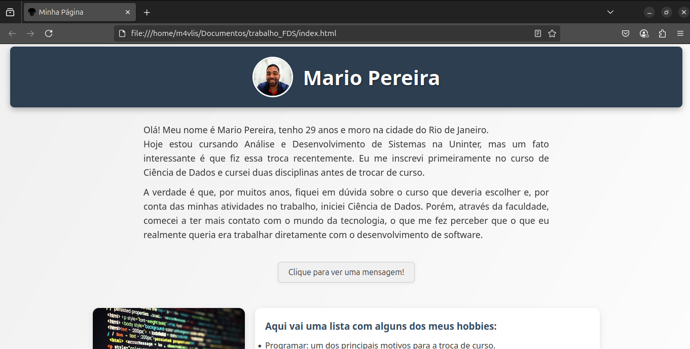

# Projeto - Página Pessoal

Este é um projeto desenvolvido como parte da disciplina de Fundamentos de Desenvolvimento de Software da faculdade. O objetivo foi criar uma página pessoal utilizando **HTML**, **CSS** e **JavaScript**, aplicando conceitos básicos de estruturação, estilização e interatividade.

---

## 🛠️ Tecnologias Utilizadas

- HTML5
- CSS3
- JavaScript (puro)

---

## 🎨 Funcionalidades da Página

- Apresentação pessoal (nome, curso, hobbies e interesses)
- Lista de países que tenho vontade de conhecer
- Slideshow com imagens
- Botão interativo com mensagem de boas-vindas
- Layout responsivo
- Estilo visual moderno com animações suaves
- Favicon personalizado

---

## 📷 Prévia da Página

---

## 🚀 Como visualizar o projeto

1. Clone o repositório ou baixe os arquivos
2. Abra o arquivo `index.html` diretamente no navegador

---

## 👨‍💻 Autor

Mario Pereira  
Aluno de Análise e Desenvolvimento de Sistemas - Uninter  
Rio de Janeiro - RJ  
